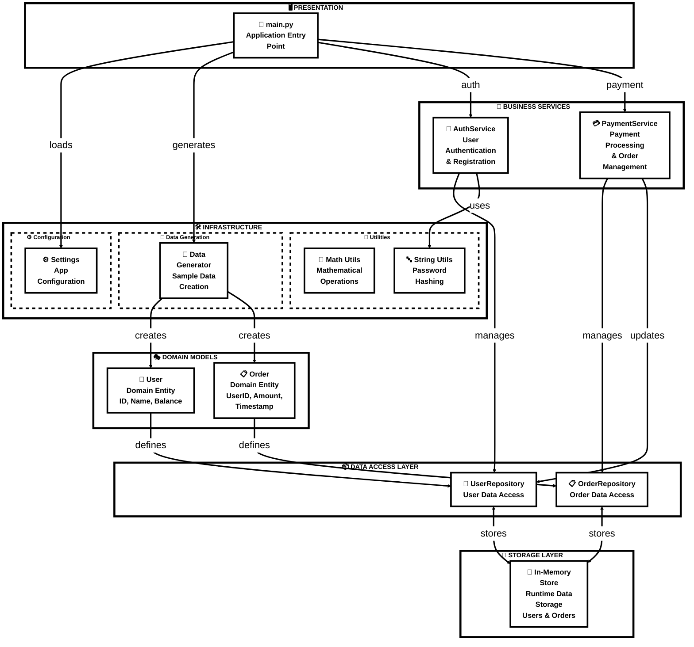

```mermaid
%%{init: {'theme': 'base', 'themeVariables': { 'background': '#ffffff', 'primaryColor': '#ffffff', 'fontSize': '24px', 'fontFamily': 'Arial', 'primaryTextColor': '#000000', 'primaryBorderColor': '#000000', 'lineColor': '#000000'}}}%%
flowchart TD
    %% ===========================================
    %% 🎯 AI Development Dataset Architecture
    %% Clean Architecture with Domain-Driven Design
    %% ===========================================

    %% 🖥️ PRESENTATION LAYER
    subgraph PRES [" 🖥️ PRESENTATION"]
        direction TB
        main["🚀 main.py<br/>Application Entry<br/>Point"]:::presentation
    end

    %% 🔧 BUSINESS LAYER
    subgraph BIZ [" 🔧 BUSINESS SERVICES "]
        direction LR
        auth["🔐 AuthService<br/>User<br/>Authentication<br/>& Registration"]:::service
        payment["💳 PaymentService<br/>Payment<br/>Processing<br/>& Order<br/>Management"]:::service
    end

    %% 📦 DATA ACCESS LAYER
    subgraph DATA [" 📦 DATA ACCESS LAYER "]
        direction LR
        urepo["👤 UserRepository<br/>User Data Access"]:::repo
        orepo["📋 OrderRepository<br/>Order Data Access"]:::repo
    end

    %% 🎭 DOMAIN MODELS
    subgraph DOMAIN [" 🎭 DOMAIN MODELS "]
        direction LR
        user["👤 User<br/>Domain Entity<br/>ID, Name, Balance"]:::domain
        order["📋 Order<br/>Domain Entity<br/>UserID, Amount,<br/>Timestamp"]:::domain
    end

    %% 🛠️ INFRASTRUCTURE
    subgraph INFRA [" 🛠️ INFRASTRUCTURE "]
        direction TB
        subgraph CONFIG [" ⚙️ Configuration "]
            config["⚙️ Settings<br/>App<br/>Configuration"]:::config
        end
        subgraph UTILS [" 🔧 Utilities "]
            direction LR
            mathu["🧮 Math Utils<br/>Mathematical<br/>Operations"]:::util
            stringu["🔤 String Utils<br/>Password<br/>Hashing"]:::util
        end
        subgraph GEN [" 🎲 Data Generation "]
            generator["🎲 Data<br/>Generator<br/>Sample Data<br/>Creation"]:::generator
        end
    end

    %% 💾 STORAGE
    subgraph STORAGE [" 💾 STORAGE LAYER "]
        store["💾 In-Memory<br/>Store<br/>Runtime Data<br/>Storage<br/>Users & Orders"]:::store
    end

    %% ===========================================
    %% 🔄 DEPENDENCIES & DATA FLOW
    %% ===========================================

    %% Main Application Flow
    main ==>|"loads"| config
    main ==>|"generates"| generator
    main ==>|"auth"| auth
    main ==>|"payment"| payment

    %% Data Generation Flow
    generator ==>|"creates"| user
    generator ==>|"creates"| order

    %% Business Service Dependencies
    auth ==>|"manages"| urepo
    auth ==>|"uses"| stringu

    payment ==>|"manages"| orepo
    payment ==>|"updates"| urepo

    %% Repository to Storage
    urepo <==>|"stores"| store
    orepo <==>|"stores"| store

    %% Domain Model Relations
    user ==>|"defines"| urepo
    order ==>|"defines"| orepo

    %% ===========================================
    %% 🔗 GITHUB LINKS
    %% ===========================================
    click main "https://github.com/soso0024/pj-aidev-dataset_prompt_docstrings/blob/main/main.py" "🚀 View Main Application"
    click config "https://github.com/soso0024/pj-aidev-dataset_prompt_docstrings/blob/main/config/settings.py" "⚙️ View Configuration"
    click generator "https://github.com/soso0024/pj-aidev-dataset_prompt_docstrings/blob/main/data/generator.py" "🎲 View Data Generator"
    click user "https://github.com/soso0024/pj-aidev-dataset_prompt_docstrings/blob/main/model/user.py" "👤 View User Model"
    click order "https://github.com/soso0024/pj-aidev-dataset_prompt_docstrings/blob/main/model/order.py" "📋 View Order Model"
    click urepo "https://github.com/soso0024/pj-aidev-dataset_prompt_docstrings/blob/main/repository/user_repo.py" "👤 View User Repository"
    click orepo "https://github.com/soso0024/pj-aidev-dataset_prompt_docstrings/blob/main/repository/order_repo.py" "📋 View Order Repository"
    click auth "https://github.com/soso0024/pj-aidev-dataset_prompt_docstrings/blob/main/service/auth.py" "🔐 View Auth Service"
    click payment "https://github.com/soso0024/pj-aidev-dataset_prompt_docstrings/blob/main/service/payment.py" "💳 View Payment Service"
    click mathu "https://github.com/soso0024/pj-aidev-dataset_prompt_docstrings/blob/main/utils/math_utils.py" "🧮 View Math Utils"
    click stringu "https://github.com/soso0024/pj-aidev-dataset_prompt_docstrings/blob/main/utils/string_utils.py" "🔤 View String Utils"

    %% ===========================================
    %% 🎨 VISUAL STYLING
    %% ===========================================

    %% Component Styles - Enhanced Borders for Export
    classDef presentation fill:#ffffff,stroke:#000000,stroke-width:4px,color:#000000,font-weight:bold,font-size:18px
    classDef service fill:#ffffff,stroke:#000000,stroke-width:4px,color:#000000,font-weight:bold,font-size:18px
    classDef repo fill:#ffffff,stroke:#000000,stroke-width:4px,color:#000000,font-weight:bold,font-size:18px
    classDef domain fill:#ffffff,stroke:#000000,stroke-width:4px,color:#000000,font-weight:bold,font-size:18px
    classDef util fill:#ffffff,stroke:#000000,stroke-width:4px,color:#000000,font-weight:bold,font-size:18px
    classDef config fill:#ffffff,stroke:#000000,stroke-width:4px,color:#000000,font-weight:bold,font-size:18px
    classDef generator fill:#ffffff,stroke:#000000,stroke-width:4px,color:#000000,font-weight:bold,font-size:18px
    classDef store fill:#ffffff,stroke:#000000,stroke-width:4px,color:#000000,font-weight:bold,font-size:18px

    %% Subgraph Styles - Enhanced Borders for Export
    classDef default fill:#ffffff,stroke:#000000,stroke-width:3px,font-size:24px,font-weight:bold,color:#000000
    style PRES fill:#ffffff,stroke:#000000,stroke-width:5px,color:#000000,font-size:16px,font-weight:bold
    style BIZ fill:#ffffff,stroke:#000000,stroke-width:5px,color:#000000,font-size:16px,font-weight:bold
    style DATA fill:#ffffff,stroke:#000000,stroke-width:5px,color:#000000,font-size:16px,font-weight:bold
    style DOMAIN fill:#ffffff,stroke:#000000,stroke-width:5px,color:#000000,font-size:16px,font-weight:bold
    style INFRA fill:#ffffff,stroke:#000000,stroke-width:5px,color:#000000,font-size:16px,font-weight:bold
    style STORAGE fill:#ffffff,stroke:#000000,stroke-width:5px,color:#000000,font-size:16px,font-weight:bold
    style CONFIG fill:#ffffff,stroke:#000000,stroke-width:4px,stroke-dasharray: 8 8,font-size:14px,font-weight:bold,color:#000000
    style UTILS fill:#ffffff,stroke:#000000,stroke-width:4px,stroke-dasharray: 8 8,font-size:14px,font-weight:bold,color:#000000
    style GEN fill:#ffffff,stroke:#000000,stroke-width:4px,stroke-dasharray: 8 8,font-size:14px,font-weight:bold,color:#000000
```
