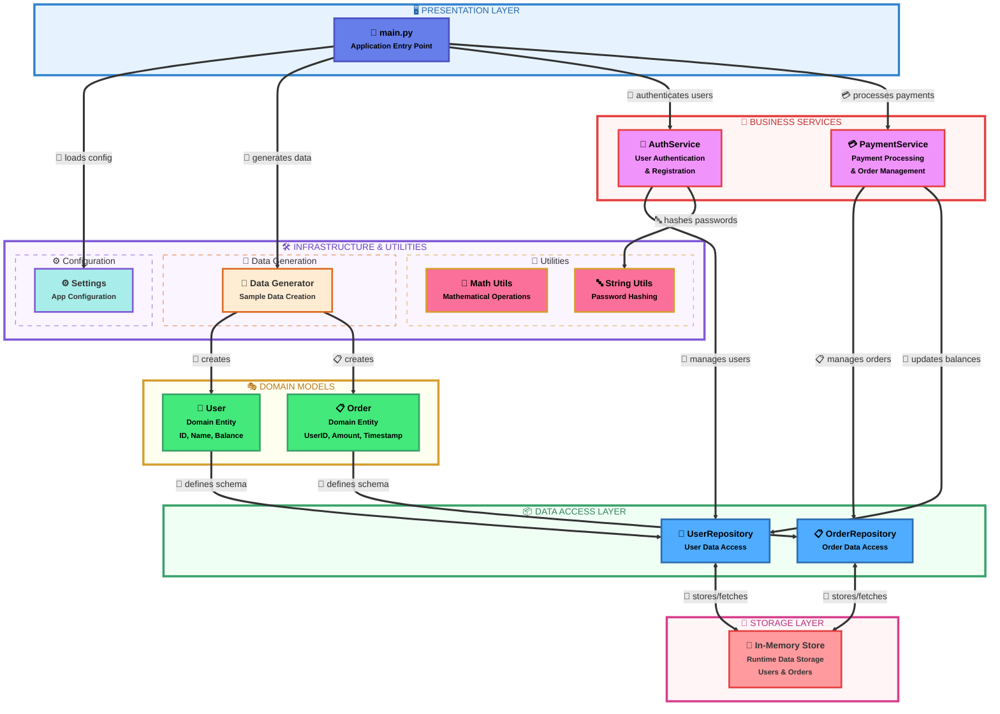

```mermaid
flowchart TD
    %% ===========================================
    %% 🎯 AI Development Dataset Architecture
    %% Clean Architecture with Domain-Driven Design
    %% ===========================================

    %% 🖥️ PRESENTATION LAYER
    subgraph PRES [" 🖥️ PRESENTATION LAYER "]
        direction TB
        main["🚀 main.py<br/><small>Application Entry Point</small>"]:::presentation
    end

    %% 🔧 BUSINESS LAYER
    subgraph BIZ [" 🔧 BUSINESS SERVICES "]
        direction LR
        auth["🔐 AuthService<br/><small>User Authentication<br/>& Registration</small>"]:::service
        payment["💳 PaymentService<br/><small>Payment Processing<br/>& Order Management</small>"]:::service
    end

    %% 📦 DATA ACCESS LAYER
    subgraph DATA [" 📦 DATA ACCESS LAYER "]
        direction LR
        urepo["👤 UserRepository<br/><small>User Data Access</small>"]:::repo
        orepo["📋 OrderRepository<br/><small>Order Data Access</small>"]:::repo
    end

    %% 🎭 DOMAIN MODELS
    subgraph DOMAIN [" 🎭 DOMAIN MODELS "]
        direction LR
        user["👤 User<br/><small>Domain Entity<br/>ID, Name, Balance</small>"]:::domain
        order["📋 Order<br/><small>Domain Entity<br/>UserID, Amount, Timestamp</small>"]:::domain
    end

    %% 🛠️ INFRASTRUCTURE
    subgraph INFRA [" 🛠️ INFRASTRUCTURE & UTILITIES "]
        direction TB
        subgraph CONFIG [" ⚙️ Configuration "]
            config["⚙️ Settings<br/><small>App Configuration</small>"]:::config
        end
        subgraph UTILS [" 🔧 Utilities "]
            direction LR
            mathu["🧮 Math Utils<br/><small>Mathematical Operations</small>"]:::util
            stringu["🔤 String Utils<br/><small>Password Hashing</small>"]:::util
        end
        subgraph GEN [" 🎲 Data Generation "]
            generator["🎲 Data Generator<br/><small>Sample Data Creation</small>"]:::generator
        end
    end

    %% 💾 STORAGE
    subgraph STORAGE [" 💾 STORAGE LAYER "]
        store["💾 In-Memory Store<br/><small>Runtime Data Storage<br/>Users & Orders</small>"]:::store
    end

    %% ===========================================
    %% 🔄 DEPENDENCIES & DATA FLOW
    %% ===========================================

    %% Main Application Flow
    main ==>|"📖 loads config"| config
    main ==>|"🎲 generates data"| generator
    main ==>|"🔐 authenticates users"| auth
    main ==>|"💳 processes payments"| payment

    %% Data Generation Flow
    generator ==>|"👤 creates"| user
    generator ==>|"📋 creates"| order

    %% Business Service Dependencies
    auth ==>|"👤 manages users"| urepo
    auth ==>|"🔤 hashes passwords"| stringu

    payment ==>|"📋 manages orders"| orepo
    payment ==>|"👤 updates balances"| urepo

    %% Repository to Storage
    urepo <==>|"💾 stores/fetches"| store
    orepo <==>|"💾 stores/fetches"| store

    %% Domain Model Relations
    user ==>|"📝 defines schema"| urepo
    order ==>|"📝 defines schema"| orepo

    %% ===========================================
    %% 🔗 GITHUB LINKS
    %% ===========================================
    click main "https://github.com/soso0024/pj-aidev-dataset_prompt_docstrings/blob/main/main.py" "🚀 View Main Application"
    click config "https://github.com/soso0024/pj-aidev-dataset_prompt_docstrings/blob/main/config/settings.py" "⚙️ View Configuration"
    click generator "https://github.com/soso0024/pj-aidev-dataset_prompt_docstrings/blob/main/data/generator.py" "🎲 View Data Generator"
    click user "https://github.com/soso0024/pj-aidev-dataset_prompt_docstrings/blob/main/model/user.py" "👤 View User Model"
    click order "https://github.com/soso0024/pj-aidev-dataset_prompt_docstrings/blob/main/model/order.py" "📋 View Order Model"
    click urepo "https://github.com/soso0024/pj-aidev-dataset_prompt_docstrings/blob/main/repository/user_repo.py" "👤 View User Repository"
    click orepo "https://github.com/soso0024/pj-aidev-dataset_prompt_docstrings/blob/main/repository/order_repo.py" "📋 View Order Repository"
    click auth "https://github.com/soso0024/pj-aidev-dataset_prompt_docstrings/blob/main/service/auth.py" "🔐 View Auth Service"
    click payment "https://github.com/soso0024/pj-aidev-dataset_prompt_docstrings/blob/main/service/payment.py" "💳 View Payment Service"
    click mathu "https://github.com/soso0024/pj-aidev-dataset_prompt_docstrings/blob/main/utils/math_utils.py" "🧮 View Math Utils"
    click stringu "https://github.com/soso0024/pj-aidev-dataset_prompt_docstrings/blob/main/utils/string_utils.py" "🔤 View String Utils"

    %% ===========================================
    %% 🎨 VISUAL STYLING
    %% ===========================================

    %% Component Styles - Professional Colors
    classDef presentation fill:#667eea,stroke:#4c51bf,stroke-width:3px,color:#000,font-weight:bold
    classDef service fill:#f093fb,stroke:#e53e3e,stroke-width:3px,color:#000,font-weight:bold
    classDef repo fill:#4facfe,stroke:#2b6cb0,stroke-width:3px,color:#000,font-weight:bold
    classDef domain fill:#43e97b,stroke:#38a169,stroke-width:3px,color:#000,font-weight:bold
    classDef util fill:#fa709a,stroke:#d69e2e,stroke-width:3px,color:#000,font-weight:bold
    classDef config fill:#a8edea,stroke:#805ad5,stroke-width:3px,color:#333,font-weight:bold
    classDef generator fill:#ffecd2,stroke:#dd6b20,stroke-width:3px,color:#333,font-weight:bold
    classDef store fill:#ff9a9e,stroke:#e53e3e,stroke-width:3px,color:#333,font-weight:bold

    %% Subgraph Styles - Subtle Background Colors
    classDef default fill:transparent,stroke:none
    style PRES fill:#e6f3ff,stroke:#3182ce,stroke-width:4px,color:#2a69ac
    style BIZ fill:#fff5f5,stroke:#e53e3e,stroke-width:4px,color:#c53030
    style DATA fill:#f0fff4,stroke:#38a169,stroke-width:4px,color:#2f855a
    style DOMAIN fill:#fffff0,stroke:#d69e2e,stroke-width:4px,color:#b7791f
    style INFRA fill:#faf5ff,stroke:#805ad5,stroke-width:4px,color:#6b46c1
    style STORAGE fill:#fff5f7,stroke:#d53f8c,stroke-width:4px,color:#b83280
    style CONFIG fill:transparent,stroke:#805ad5,stroke-width:1px,stroke-dasharray: 8 8
    style UTILS fill:transparent,stroke:#d69e2e,stroke-width:1px,stroke-dasharray: 8 8
    style GEN fill:transparent,stroke:#dd6b20,stroke-width:1px,stroke-dasharray: 8 8
```
